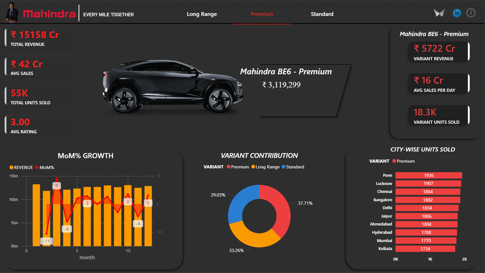
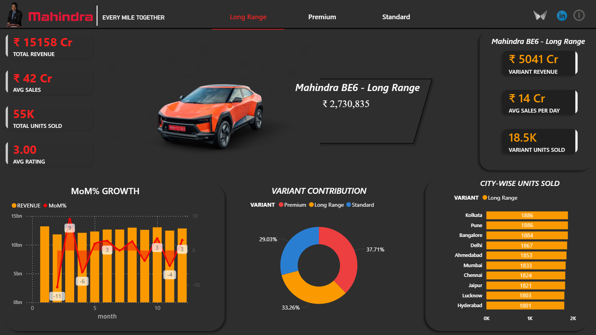
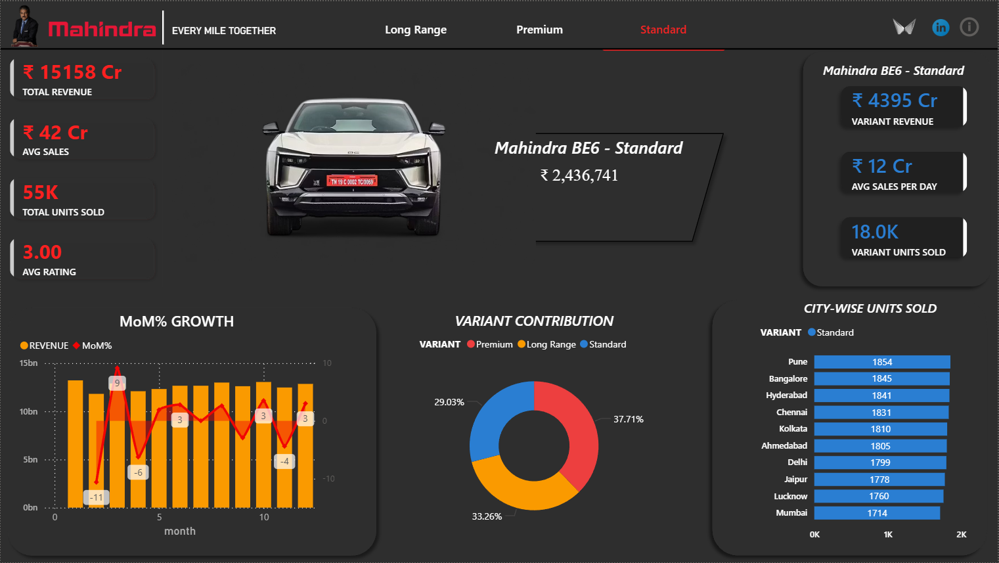

# 🚗 Mahindra BE6 Sales Dashboard

## 📌 Overview
This project is an interactive Power BI dashboard built to analyze the sales performance of Mahindra BE6 variants.

The dashboard includes:
- Dynamic KPI cards
- Variant-based filtering
- Dynamic car image changes
- Tooltips
- Revenue and sales analysis

---

## 🛠️ Technologies Used
- Power BI
- MySQL
- SQL
- CSV
- Adobe Premiere Pro
---

## 📊 Dashboard Preview

---

## 🎥 Project Demo Video
Watch the full dashboard demo here:

[YOUR_YOUTUBE_LINK_HERE](https://youtube.com/shorts/7o_BJFr9jo8?si=kizEZ2CAMXSUQT7N)

---

## 📂 Files Included
- Final Mahindra Dashboard (.pbix)
- Mahindra SQL export File
- Dashboard Images
- README Documentation

---

## 👨‍💻 Author
Arnob Khan

LinkedIn:
[YOUR_LINKEDIN_URL](https://www.linkedin.com/in/arnob-khan/)
